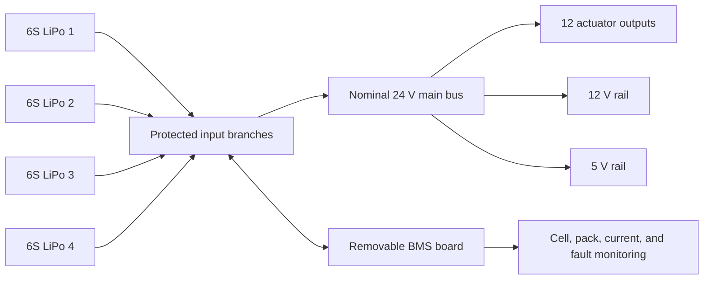
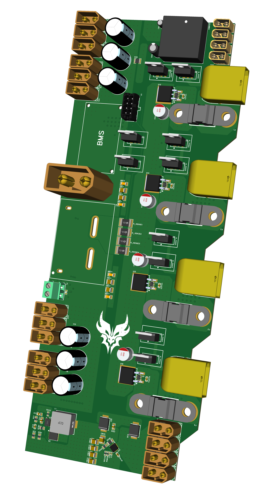
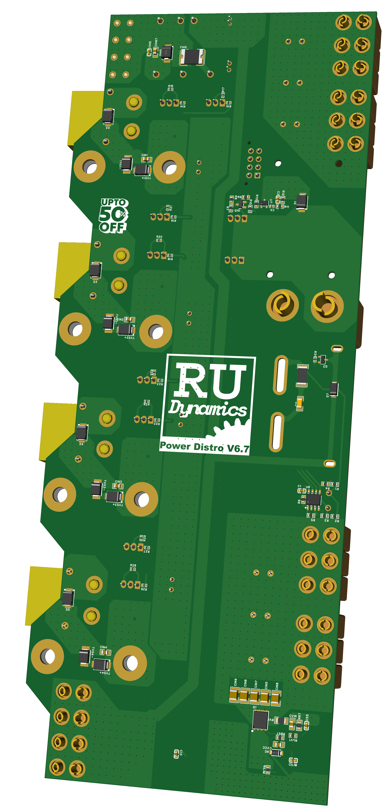
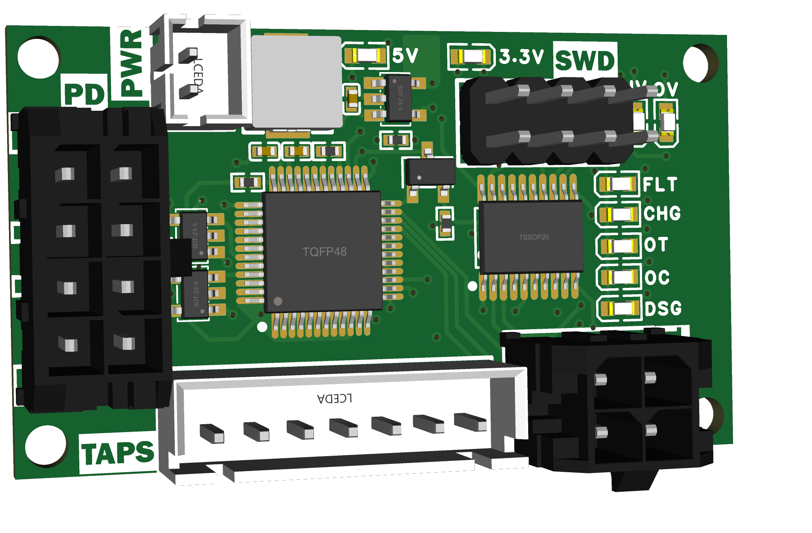
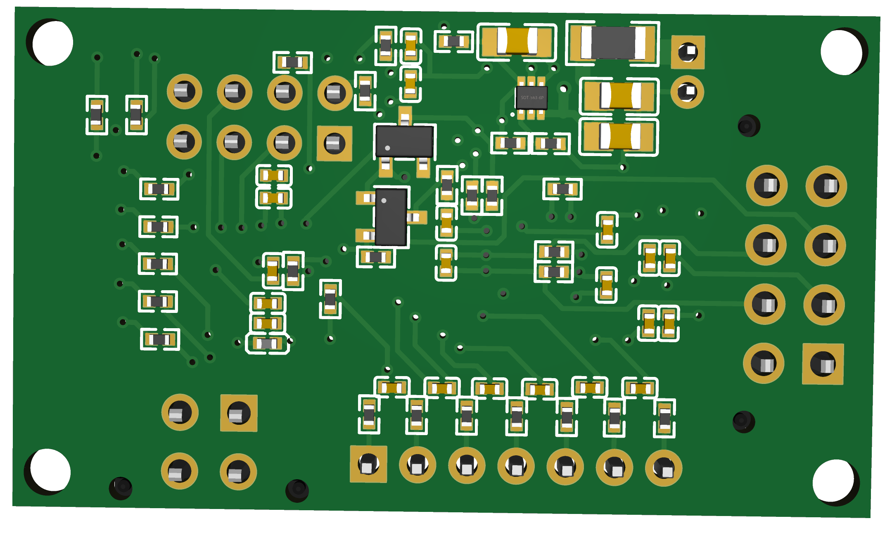

<div align="center">
  <div>
    
    
    
  </div>
  <h1>&#9889; RU Dynamics Power Electronics</h1>
  <p>Custom power-distribution and battery-monitoring hardware for the RU Dynamics quadruped robot.</p>
</div>

> [!WARNING]
> This project is currently a pre-production hardware design. The boards have not yet been assembled, powered, or bench-validated, so all current limits, thermal behavior, protection behavior, and rail capabilities in this README should be treated as design targets rather than verified performance.

## Overview

This system was designed as the electrical backbone for an RU Dynamics quadruped platform.

It combines four 6S LiPo inputs into a shared nominal 24 V power bus, distributes that power to the robot's actuator system, generates regulated auxiliary rails, and pairs with a removable battery-management board for pack monitoring and future fault handling.

At a high level, the project is split into two boards:

- A high-current main power-distribution board
- A removable BMS and control board that mounts onto the distro

## Why This Exists

Quadruped robots need more than just "battery in, motors out."

The goal of this design is to create a power platform that can:

- Safely parallel multiple high-current battery inputs
- Feed a shared actuator bus for a 12-motor robot
- Manage inrush current during startup with precharge
- Generate regulated 12 V and 5 V rails for onboard electronics
- Monitor pack and cell health through a dedicated BMS path
- Leave room for future firmware features like CAN telemetry and thermal shutdown

## System Architecture



## Board Renders

### Main Power-Distribution Board

<table align="center">
  <tr>
    <td align="center" width="50%">
      
    </td>
    <td align="center" width="50%">
      
    </td>
  </tr>
  <tr>
    <td align="center"><sub>Top view</sub></td>
    <td align="center"><sub>Bottom view</sub></td>
  </tr>
</table>

Top and bottom 3D renders of the main power-distribution board, showing the high-current bus structure, actuator output distribution, auxiliary power circuitry, and board-to-board interface area for the removable BMS module.

### Battery-Management Board

<table align="center">
  <tr>
    <td align="center" width="50%">
      
    </td>
    <td align="center" width="50%">
      
    </td>
  </tr>
  <tr>
    <td align="center"><sub>Top view</sub></td>
    <td align="center"><sub>Bottom view</sub></td>
  </tr>
</table>

Top and bottom 3D renders of the BMS daughterboard, including the monitoring IC, STM32 controller, SWD header, power domains, and connector interface back into the main distro.

## Core Hardware Features

### Main Power-Distribution Board

- Four independent 6S LiPo battery inputs
- Individual input-path fusing
- Reverse-polarity protection
- Ideal-diode MOSFET control
- Per-input current sensing
- High-current combined output bus
- Main-bus precharge path
- Bulk-capacitor bank for bus support
- Transient and surge suppression
- Regulated 12 V output
- Regulated 5 V output
- Multilayer high-current PCB with large copper regions and dense via stitching

### Battery-Management Board

- Dedicated battery-monitoring IC
- STM32 microcontroller
- Individual cell-voltage monitoring
- Pack-voltage monitoring
- Passive cell balancing
- Overcurrent, overvoltage, and undervoltage detection
- Temperature-sensor support
- SWD programming and debugging
- Charge, discharge, and fault indication
- Onboard 5 V and 3.3 V power
- Future CAN communication support

## Design Targets

These numbers are preliminary and still need thermal and bench validation.

| Parameter | Current design target |
| --- | --- |
| Battery inputs | 4x 6S LiPo |
| System bus | Nominal 24 V |
| Per-branch nominal current | ~15 A |
| Per-branch short-duration peak | ~25 A |
| Combined nominal system current | ~60 A |
| Bulk capacitance | 6 x 1000 uF |
| Capacitor voltage rating | 50 V |
| Auxiliary rail | 12 V buck output |
| Auxiliary rail | 5 V regulated output |
| Actuator distribution | 12 outputs |

## Power Path Notes

### High-Current Distribution

The main bus is intended to feed twelve actuator outputs for a four-legged robot with three actuators per leg. The layout uses wide copper, parallel current paths, multilayer routing, and aggressive via stitching to support high-current operation, but the true continuous current capability is still unmeasured.

### Precharge and Inrush Control

The board includes a precharge path to reduce startup inrush into the downstream bus capacitance. Resistor heating, timing, bypass behavior, and real startup current still need to be characterized during bring-up.

### Transient Protection

Clamp and suppression components are included to reduce voltage spikes from motor switching, regenerative events, wiring inductance, and battery hot-plugging. Their effectiveness under real actuator loading remains unverified.

## BMS Scope

The removable BMS board is intended to monitor pack condition and eventually support smarter system-level power decisions.

Designed monitoring coverage includes:

- Individual cell voltages
- Pack voltage
- Charge and discharge current
- Overcurrent events
- Overvoltage and undervoltage events
- Temperature inputs
- Fault state reporting

Passive balancing is included in the design, while balancing thresholds, thermal behavior, and protection tuning will be finalized during firmware bring-up and hardware validation.

## Repository Layout

```text
full_project_file/
  RU-Dynamics-Power-Distro-v0.6.7.epro2   # authoritative EasyEDA Pro project archive

Mainboard_files/
  power-distro-schematic.epro2
  power-distro-pcb.epro2

BMS_files/
  bms-schematic.epro2
  bms-pcb.epro2

3D_renders/
  Mainboard_topview_clean.png
  Mainboard_botview_clean.png
  BMS_topview_clean.png
  BMS_botview_clean.png
```

The complete `full_project_file/RU-Dynamics-Power-Distro-v0.6.7.epro2` archive should be treated as the main EasyEDA Pro project source. The individual board files are included separately for easier inspection and navigation.

## Development Status

This design is still in the prototype stage. Remaining work includes:

- Schematic review
- PCB review
- BOM and sourcing validation
- Bare-board inspection
- Assembly
- Low-voltage bring-up
- Rail validation
- Current-sense calibration
- BMS firmware development
- Precharge validation
- Reverse-polarity testing
- Overcurrent testing
- Thermal characterization
- Full actuator-load testing
- Fault-response validation
- CAN integration

## Safety Notice

This project uses multiple high-current lithium-polymer battery inputs. A system like this can deliver enough current to damage hardware, overheat wiring, destroy connectors, or create a serious fire risk if handled incorrectly.

Initial testing should only be done with:

- Correctly rated fuses
- Current-limited supplies during early bring-up
- Verified connector polarity
- Proper precharge procedure
- Insulated tools
- Eye protection
- Temperature monitoring
- A battery-fire response plan

Never connect parallel packs with significantly different voltages, and do not treat this design as production-ready or safety-certified until it has been thoroughly validated.

## Team

Developed for the RU Dynamics quadruped platform in collaboration with Soham Joshi and Nikhil Reddy.

## License

MIT
